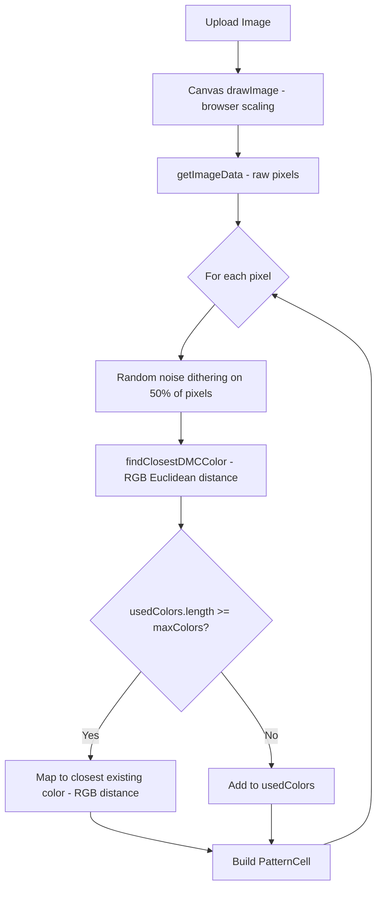
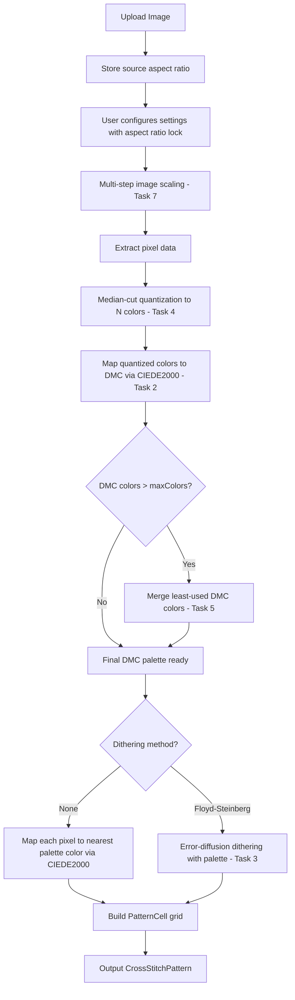

# Image Quality Improvements Plan

## Overview

The current image-to-pattern pipeline in [`imageProcessor.ts`](src/utils/imageProcessor.ts) has several quality issues that produce suboptimal cross-stitch patterns. This plan addresses 7 specific deficiencies across the color matching, dithering, color reduction, aspect ratio, and scaling subsystems.

---

## Current Architecture



**Key problems in this pipeline:**
1. Only 47 DMC colors available — real catalog has ~500
2. Color matching uses perceptually non-uniform RGB Euclidean distance
3. Dithering is random noise, not error-diffusion
4. No color reduction/quantization before DMC matching
5. Color limiting is order-dependent — first-seen colors win
6. Width/height set independently — no aspect ratio lock
7. Image scaling depends on browser interpolation quality

---

## Task Breakdown

### Task 1: Expand DMC Color Palette

**Problem:** [`dmc-colors.ts`](src/data/dmc-colors.ts) defines only 47 colors. The real DMC catalog has ~500 colors. Some entries have duplicate RGB values — e.g., [`803`](src/data/dmc-colors.ts:26) and [`807`](src/data/dmc-colors.ts:27) both map to `#008080`, and [`992`](src/data/dmc-colors.ts:29) and [`993`](src/data/dmc-colors.ts:30) both map to `#000080`.

**Requirements:**
- Replace the 47-color palette with a comprehensive ~450+ DMC color dataset using verified RGB values from authoritative sources
- Each entry must include: `id`, `name`, `hex`, and `rgb` tuple
- Remove all duplicate RGB entries — each DMC color must have a unique, accurate RGB value
- Verify that commonly-used anchor colors like DMC 310 Black, DMC White, DMC 666 Bright Red have correct values
- Add a `lab` property to the [`DMCColor`](src/types/pattern.ts:1) interface for pre-computed CIE Lab values to avoid runtime conversion overhead

**Files to modify:**
- [`src/types/pattern.ts`](src/types/pattern.ts) — add `lab?: [number, number, number]` to `DMCColor`
- [`src/data/dmc-colors.ts`](src/data/dmc-colors.ts) — replace entire color array with full catalog

---

### Task 2: Implement CIE Lab Color Matching with CIEDE2000

**Problem:** [`findClosestDMCColor()`](src/data/dmc-colors.ts:66) uses Euclidean distance in RGB space, which is perceptually non-uniform. Two colors that look very different to humans can have a small RGB distance, and vice versa.

**Requirements:**
- Create a new utility module `src/utils/colorUtils.ts` with:
  - `rgbToLab(r, g, b)` — convert RGB to CIE Lab via XYZ intermediate
  - `ciede2000(lab1, lab2)` — implement the CIEDE2000 delta-E formula for perceptual color difference
  - `findClosestDMCColorLab(rgb)` — find nearest DMC color using CIEDE2000 distance
- Pre-compute Lab values for all DMC colors at module load time and cache them
- Replace all calls to the old [`findClosestDMCColor()`](src/data/dmc-colors.ts:66) with the new Lab-based version
- Also update [`findClosestExistingColor()`](src/utils/imageProcessor.ts:107) in `ImageProcessor` to use CIEDE2000

**Files to create:**
- `src/utils/colorUtils.ts`

**Files to modify:**
- [`src/data/dmc-colors.ts`](src/data/dmc-colors.ts) — remove old `findClosestDMCColor`, or re-export from colorUtils
- [`src/utils/imageProcessor.ts`](src/utils/imageProcessor.ts) — update imports and color matching calls

---

### Task 3: Implement Floyd-Steinberg Error-Diffusion Dithering

**Problem:** The current dithering in [`processImage()`](src/utils/imageProcessor.ts:25) at lines 63-68 applies random noise to 50% of pixels. This produces random speckle rather than smooth gradient transitions.

**Requirements:**
- Implement Floyd-Steinberg error-diffusion dithering as a processing option
- The algorithm must:
  1. Process pixels in raster order — left-to-right, top-to-bottom
  2. For each pixel, find the closest DMC color
  3. Calculate the quantization error — difference between original and matched color
  4. Distribute the error to neighboring unprocessed pixels using the standard kernel:
     ```
              current    7/16 →
     3/16 ↙   5/16 ↓   1/16 ↘
     ```
  5. Clamp pixel values to 0-255 after error addition
- Add a `ditheringMethod` field to [`PatternSettings`](src/types/pattern.ts:24): `'none' | 'floyd-steinberg'`
- Update the settings UI in [`SettingsStep.tsx`](src/components/steps/SettingsStep.tsx) to offer dithering method selection instead of a simple toggle
- Remove the old random noise dithering code entirely

**Files to modify:**
- [`src/types/pattern.ts`](src/types/pattern.ts) — change `dithering: boolean` to `ditheringMethod: 'none' | 'floyd-steinberg'`
- [`src/utils/imageProcessor.ts`](src/utils/imageProcessor.ts) — implement Floyd-Steinberg in `processImage()`
- [`src/components/steps/SettingsStep.tsx`](src/components/steps/SettingsStep.tsx) — update dithering UI control
- [`src/components/PatternSettings.tsx`](src/components/PatternSettings.tsx) — update dithering UI control
- [`src/app/page.tsx`](src/app/page.tsx) — update default settings

---

### Task 4: Add Pre-Processing Color Quantization

**Problem:** Colors are currently matched one pixel at a time with no global analysis. This means the algorithm has no awareness of which colors are most important in the image.

**Requirements:**
- Implement median-cut color quantization as a pre-processing step before DMC matching:
  1. Collect all non-transparent pixel colors from the scaled image
  2. Apply median-cut to reduce to `maxColors` representative colors
  3. Map each representative color to its nearest DMC color using CIEDE2000
  4. Build the final DMC palette from these mapped colors
  5. Then re-map every pixel to the nearest color in this curated DMC palette
- This replaces the current approach where [`maxColors`](src/utils/imageProcessor.ts:75) is enforced by order-of-appearance
- The quantization should happen after image scaling but before pixel-by-pixel processing
- Create the quantization logic in a new module `src/utils/colorQuantization.ts`

**Files to create:**
- `src/utils/colorQuantization.ts` — median-cut algorithm implementation

**Files to modify:**
- [`src/utils/imageProcessor.ts`](src/utils/imageProcessor.ts) — integrate quantization into the pipeline before per-pixel matching

---

### Task 5: Fix Color Limiting to Be Frequency-Based

**Problem:** The [`maxColors` enforcement](src/utils/imageProcessor.ts:75) at line 75 is order-dependent. Whichever colors appear first in raster-scan order get added to `usedColors`. A rare color in the top-left corner gets priority over a dominant color that first appears later.

**Requirements:**
- This is largely solved by Task 4 — median-cut inherently prioritizes colors by the volume of pixels they represent
- As a safety net, after quantization and DMC mapping, if more than `maxColors` DMC colors result due to multiple quantized colors mapping to different DMC entries, merge the least-used DMC colors into their nearest neighbors
- The merge should be based on:
  1. Count how many pixels map to each DMC color
  2. While color count > maxColors: find the DMC color with the fewest pixels, merge it into its nearest DMC neighbor using CIEDE2000 distance
- Remove the old order-dependent color limiting code from [`processImage()`](src/utils/imageProcessor.ts:75)

**Files to modify:**
- [`src/utils/imageProcessor.ts`](src/utils/imageProcessor.ts) — remove old limiting, add frequency-based merge
- [`src/utils/colorQuantization.ts`](src/utils/colorQuantization.ts) — add merge-by-frequency utility

---

### Task 6: Add Aspect Ratio Preservation

**Problem:** In [`SettingsStep.tsx`](src/components/steps/SettingsStep.tsx), width and height are set independently via separate sliders at lines 99-155. The image can be stretched or distorted.

**Requirements:**
- Add a lock/unlock aspect ratio toggle to the settings UI
  - When locked: changing width auto-calculates height to preserve the source image aspect ratio, and vice versa
  - When unlocked: current independent behavior is preserved
  - Default state: locked
- Store the source image aspect ratio when the image is loaded in [`page.tsx`](src/app/page.tsx)
- Add `lockAspectRatio` to [`PatternSettings`](src/types/pattern.ts:24) interface
- The aspect ratio lock icon should be visually clear — a chain-link or padlock icon between the width and height controls
- Round calculated dimensions to the nearest integer

**Files to modify:**
- [`src/types/pattern.ts`](src/types/pattern.ts) — add `lockAspectRatio: boolean` to `PatternSettings`
- [`src/components/steps/SettingsStep.tsx`](src/components/steps/SettingsStep.tsx) — add lock toggle and auto-calculation logic
- [`src/components/PatternSettings.tsx`](src/components/PatternSettings.tsx) — add lock toggle and auto-calculation logic
- [`src/app/page.tsx`](src/app/page.tsx) — store source image aspect ratio, update default settings

---

### Task 7: Implement Controlled Image Scaling

**Problem:** [`processImage()`](src/utils/imageProcessor.ts:40) at line 40 uses `ctx.drawImage(img, 0, 0, width, height)` which relies on the browser's canvas interpolation algorithm. Different browsers produce different quality results, and the default is often bilinear which can be blurry or aliased.

**Requirements:**
- Set `ctx.imageSmoothingEnabled = true` and `ctx.imageSmoothingQuality = 'high'` before `drawImage()` for browsers that support it
- Implement multi-step downscaling for large size reductions — when the target is less than 50% of the source, scale in multiple 50% steps to avoid aliasing:
  1. Create a temporary canvas
  2. Repeatedly halve the image dimensions until within 2x of the target
  3. Do the final scale to exact target dimensions
- This produces consistent, high-quality results across browsers
- Add this as a private method `scaleImage()` in [`ImageProcessor`](src/utils/imageProcessor.ts:4)

**Files to modify:**
- [`src/utils/imageProcessor.ts`](src/utils/imageProcessor.ts) — add `scaleImage()` method, update `processImage()` to use it

---

## Revised Processing Pipeline



---

## Implementation Order

The tasks should be implemented in this order due to dependencies:

1. **Task 1** — Expand DMC palette — foundation for everything else
2. **Task 2** — CIE Lab / CIEDE2000 — needed by Tasks 3, 4, 5
3. **Task 7** — Controlled scaling — independent, improves input quality
4. **Task 6** — Aspect ratio lock — independent UI improvement
5. **Task 4** — Color quantization — depends on Task 2
6. **Task 5** — Frequency-based color limiting — depends on Tasks 2, 4
7. **Task 3** — Floyd-Steinberg dithering — depends on Tasks 2, 4 for best results

---

## New Dependencies

- No new npm packages required — all algorithms are implemented from scratch
- The CIE Lab conversion and CIEDE2000 formula are well-documented standards that can be implemented in pure TypeScript

## Testing Considerations

- Test with images that have smooth gradients — sky photos, portraits — to verify dithering quality
- Test with images that have many distinct colors to verify quantization
- Test with very small target sizes — 20x20 — to verify scaling quality
- Compare before/after with the same source image to validate improvements
- Verify that the expanded DMC palette produces more accurate color matches on known reference images
