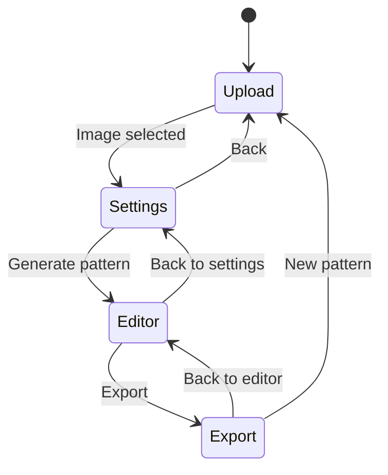

# UI Redesign Implementation Plan — Concept A: "Cozy Craft Room"

## Chosen Direction
Warm, crafty aesthetic with a **wizard-style step-by-step flow** (Upload → Settings → Edit → Export). Progressive disclosure, collapsible panels in the editor, and a cozy visual identity.

---

## Design Tokens & Theme

### Color Palette
| Token | Hex | Usage |
|---|---|---|
| `--rose` | `#E8B4B8` | Primary accent, buttons, active states |
| `--rose-dark` | `#D4919A` | Hover states, borders |
| `--rose-light` | `#F5DDE0` | Subtle backgrounds, highlights |
| `--cream` | `#FFF8F0` | Page background |
| `--linen` | `#FAF6F1` | Card backgrounds |
| `--sage` | `#A8C5A0` | Success states, secondary accent |
| `--sage-dark` | `#8BAF82` | Hover on success elements |
| `--charcoal` | `#3D3D3D` | Primary text |
| `--warm-gray` | `#6B6360` | Secondary text |
| `--warm-gray-light` | `#B8B2AD` | Disabled text, borders |
| `--warm-white` | `#FFFDFB` | Input backgrounds |

### Typography
- **Headings**: DM Serif Display (Google Fonts) — warm, elegant serif
- **Body**: Inter (Google Fonts) — clean, readable sans-serif
- **Monospace**: Keep Geist Mono for any code/technical displays

### Decorative Elements
- Subtle cross-stitch border pattern (CSS repeating background or SVG)
- Soft drop shadows (`0 2px 8px rgba(61, 61, 61, 0.08)`)
- Rounded corners (`border-radius: 12px` for cards, `8px` for inputs)

---

## Component Architecture

### New Components to Create

```
src/components/
├── layout/
│   ├── Header.tsx              # App header with logo and nav
│   └── StepIndicator.tsx       # Wizard step progress bar
├── steps/
│   ├── UploadStep.tsx          # Step 1: Image upload with preview
│   ├── SettingsStep.tsx        # Step 2: Configure pattern settings
│   ├── EditorStep.tsx          # Step 3: Pattern editor with panels
│   └── ExportStep.tsx          # Step 4: Export options and preview
├── editor/
│   ├── EditorToolbar.tsx       # Collapsible left tool panel
│   ├── EditorCanvas.tsx        # Refactored PatternGrid with zoom/pan
│   ├── EditorColorPanel.tsx    # Collapsible right color/legend panel
│   └── ZoomControls.tsx        # Zoom in/out/fit controls
├── ui/
│   ├── Button.tsx              # Themed button component
│   ├── Card.tsx                # Themed card wrapper
│   ├── Input.tsx               # Themed input component
│   ├── Select.tsx              # Themed select component
│   ├── Toast.tsx               # Toast notification system
│   └── Slider.tsx              # Themed range slider
├── ColorLegend.tsx             # (refactored)
├── ExportOptions.tsx           # (refactored into ExportStep)
├── ImageUploader.tsx           # (refactored into UploadStep)
├── PatternGrid.tsx             # (refactored into EditorCanvas)
├── PatternSettings.tsx         # (refactored into SettingsStep)
└── ToolPalette.tsx             # (refactored into EditorToolbar)
```

### Modified Files
- `src/app/page.tsx` — Complete rewrite to wizard-based flow
- `src/app/layout.tsx` — Add Google Fonts, update metadata
- `src/app/globals.css` — New theme variables, decorative styles, remove dark mode override

---

## Page Flow & State Machine



### State Management
The main `page.tsx` will manage:
- `currentStep`: 1 | 2 | 3 | 4
- `uploadedImage`: HTMLImageElement | null
- `settings`: PatternSettings
- `pattern`: CrossStitchPattern | null
- `selectedTool`: Tool
- `selectedColor`: DMCColor | null

Navigation rules:
- Step 1 → 2: requires `uploadedImage` to be set
- Step 2 → 3: requires pattern generation (triggers `processImage`)
- Step 3 → 4: always available when pattern exists
- Back navigation: always available, preserves state

---

## Detailed Step Layouts

### Step 1: Upload
- Large centered drop zone with dashed border in `--rose`
- Upload icon with warm styling
- "Recent patterns" section below (future feature placeholder)
- Animated transition when image is selected

### Step 2: Settings
- **Left side**: Image preview with semi-transparent grid overlay showing approximate stitch count
- **Right side**: Settings form with themed inputs
  - Width/Height as sliders with numeric input
  - Cloth count as styled select
  - Max colors as styled select
  - Dithering toggle switch
  - Estimated size card
- "Generate Pattern" primary button

### Step 3: Editor
- **Collapsible left panel**: Tools (draw, erase, fill, color picker) + brush size
- **Center**: Pattern canvas with zoom/pan
  - Zoom controls floating bottom-center
  - Grid/symbol/color toggle buttons floating top-right of canvas
- **Collapsible right panel**: Color legend with stitch counts and skein estimates
- "New Pattern" and "Export" buttons in header area

### Step 4: Export
- Pattern preview thumbnail
- Export format cards (Image, PDF, JSON) as large clickable cards
- Import JSON option
- Pattern summary (dimensions, colors, estimated skeins)

---

## Implementation Order

### Phase 1: Foundation
1. Update `globals.css` with new theme tokens and base styles
2. Update `layout.tsx` with Google Fonts and metadata
3. Create `ui/Button.tsx`, `ui/Card.tsx`, `ui/Input.tsx`, `ui/Select.tsx` base components
4. Create `layout/Header.tsx` component
5. Create `layout/StepIndicator.tsx` component

### Phase 2: Wizard Flow
6. Rewrite `page.tsx` with step-based state machine
7. Create `steps/UploadStep.tsx` (refactor from ImageUploader)
8. Create `steps/SettingsStep.tsx` (refactor from PatternSettings)
9. Create `steps/EditorStep.tsx` (shell with panels)
10. Create `steps/ExportStep.tsx` (refactor from ExportOptions)

### Phase 3: Editor Enhancement
11. Create `editor/EditorToolbar.tsx` (refactor from ToolPalette)
12. Create `editor/EditorCanvas.tsx` (refactor PatternGrid with zoom/pan)
13. Create `editor/EditorColorPanel.tsx` (refactor from ColorLegend)
14. Create `editor/ZoomControls.tsx`
15. Add canvas zoom/pan functionality

### Phase 4: Polish
16. Create `ui/Toast.tsx` and replace all `alert()` calls
17. Add step transition animations
18. Add keyboard shortcuts for tools
19. Responsive design pass for mobile/tablet
20. Cross-stitch decorative border SVG/CSS pattern
21. Final visual polish and testing

---

## Dependencies
- **Google Fonts**: DM Serif Display + Inter (via `next/font/google` — already using this pattern)
- **No new npm packages required** — all achievable with existing Tailwind + React
- Optional: `framer-motion` for step transition animations (can be added if desired)

---

## Files That Will Be Deleted (After Refactoring)
None — the original components will be kept as-is during development and can be removed once the new components are verified working. The old components will simply no longer be imported.
