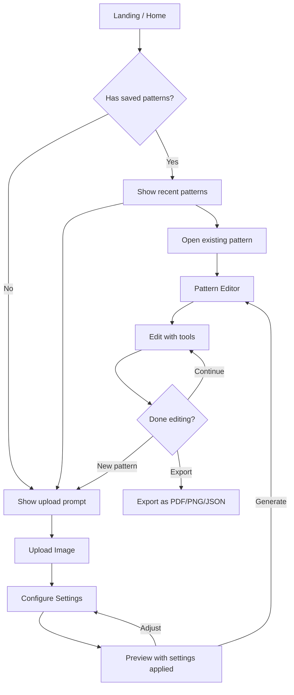

# Katia's Cross Stitch Pattern Generator — UI Redesign Mockups

## Current State Analysis

The existing UI uses a **3-column layout** on a single page:
- **Left sidebar**: Pattern Settings, Tool Palette, Export Options (stacked vertically)
- **Center**: Image uploader OR Pattern editor canvas
- **Right sidebar**: Color Legend

### Pain Points
1. **Overwhelming first impression** — all controls visible at once, even before an image is uploaded
2. **No visual identity** — generic gray/white/blue Tailwind defaults
3. **Poor mobile experience** — 3-column grid collapses awkwardly
4. **No clear workflow** — user must discover the upload → configure → edit → export flow on their own
5. **Wasted space** — tools/export/legend shown even when no pattern exists

---

## Concept A: "Cozy Craft Room" — Warm & Step-by-Step

### Visual Identity
- **Palette**: Soft rose `#E8B4B8`, warm cream `#FFF8F0`, muted sage `#A8C5A0`, charcoal `#3D3D3D`, linen white `#FAF6F1`
- **Typography**: Rounded serif for headings (e.g., DM Serif Display), clean sans for body (Inter)
- **Accents**: Subtle cross-stitch border patterns as decorative elements, soft shadows, rounded corners
- **Feel**: Like opening a beautiful craft journal

### Layout & Flow — Wizard-Style with Persistent Navigation

```
+------------------------------------------------------------------+
|  🧵 Katia's Cross Stitch          [My Patterns] [Help]  [Export] |
|  Pattern Generator                                                |
+------------------------------------------------------------------+
|                                                                    |
|   ① Upload  ——→  ② Settings  ——→  ③ Edit  ——→  ④ Export          |
|   ●              ○                ○              ○                 |
|                                                                    |
+------------------------------------------------------------------+
|                                                                    |
|                    STEP CONTENT AREA                               |
|                                                                    |
|         +------------------------------------------+               |
|         |                                          |               |
|         |     Drop your image here                 |               |
|         |     or click to browse                   |               |
|         |                                          |               |
|         |     🖼️  JPG, PNG, GIF, WebP              |               |
|         |                                          |               |
|         +------------------------------------------+               |
|                                                                    |
|         Recent patterns:                                           |
|         [thumb1] [thumb2] [thumb3]                                 |
|                                                                    |
+------------------------------------------------------------------+
```

**Step ② Settings** — appears after image upload:
```
+------------------------------------------------------------------+
|   ① Upload ✓ ——→  ② Settings  ——→  ③ Edit  ——→  ④ Export        |
+------------------------------------------------------------------+
|                                                                    |
|  +------------------+    +------------------------------------+    |
|  |                  |    |  Pattern Settings                  |    |
|  |  IMAGE PREVIEW   |    |                                    |    |
|  |  with overlay    |    |  Width: [====|====] 100 stitches   |    |
|  |  showing grid    |    |  Height: [====|====] 100 stitches  |    |
|  |                  |    |  Cloth: [14 count ▼]               |    |
|  |                  |    |  Colors: [30 ▼]                    |    |
|  |                  |    |  ☐ Dithering                       |    |
|  +------------------+    |                                    |    |
|                          |  Estimated: 18.1cm × 18.1cm        |    |
|                          |  Total: 10,000 stitches             |    |
|                          |                                    |    |
|                          |  [Generate Pattern →]              |    |
|                          +------------------------------------+    |
+------------------------------------------------------------------+
```

**Step ③ Edit** — full-width editor with collapsible side panels:
```
+------------------------------------------------------------------+
|   ① ✓  ——→  ② ✓  ——→  ③ Edit  ——→  ④ Export                    |
+------------------------------------------------------------------+
| [Tools]  |          PATTERN CANVAS            |  [Colors]  |      |
| ┌──────┐ |   with zoom/pan controls           | ┌────────┐ |      |
| |✏ Draw| |                                    | | Legend  | |      |
| |🧹Erase| |   ┌─────────────────────────┐     | | DMC-310 | |      |
| |🪣 Fill| |   │                         │     | | DMC-321 | |      |
| |💉 Pick| |   │    Cross Stitch Grid    │     | | DMC-433 | |      |
| |       | |   │                         │     | | ...     | |      |
| |Size: 1| |   │                         │     | |         | |      |
| └──────┘ |   └─────────────────────────┘     | | Skeins  | |      |
|  ◀ hide  |   [−] [100%] [+]  [Fit]           | | needed  | |      |
|           |                                    | └────────┘ |      |
+------------------------------------------------------------------+
```

### Key UX Improvements
- **Progressive disclosure**: only show what's relevant at each step
- **Collapsible side panels** in editor mode to maximize canvas space
- **Zoom/pan controls** on the canvas
- **Step indicator** always visible so user knows where they are
- **Back navigation** to revisit previous steps without losing work

---

## Concept B: "Design Studio" — Clean & Professional

### Visual Identity
- **Palette**: Deep indigo `#1E1B4B`, electric violet `#7C3AED`, cool gray `#F1F5F9`, white `#FFFFFF`, soft blue `#DBEAFE`
- **Typography**: Geometric sans (e.g., Plus Jakarta Sans) for everything
- **Accents**: Crisp borders, subtle gradients, icon-driven UI, minimal decoration
- **Feel**: Like a professional design tool (Figma/Canva-inspired)

### Layout — App Shell with Toolbar

```
+------------------------------------------------------------------+
| 🧵 Katia's                                                       |
| [New] [Open] [Save]    Pattern: Untitled    [⚙ Settings] [Export]|
+------------------------------------------------------------------+
| TOOLBAR                                                           |
| [✏️] [🧹] [🪣] [💉] | Size: [1] | Color: [■ DMC-310 ▼] | [Grid ☑] [Sym ☑] |
+------------------------------------------------------------------+
|                        |                                          |
|   COLOR PALETTE        |         CANVAS WORKSPACE                 |
|   ┌──────────────┐     |                                          |
|   | Search colors |     |    ┌──────────────────────────┐         |
|   | ┌──┬──┬──┬──┐ |     |    │                          │         |
|   | │  │  │  │  │ |     |    │                          │         |
|   | ├──┼──┼──┼──┤ |     |    │     PATTERN GRID         │         |
|   | │  │  │  │  │ |     |    │                          │         |
|   | └──┴──┴──┴──┘ |     |    │                          │         |
|   |               |     |    └──────────────────────────┘         |
|   | LEGEND        |     |                                          |
|   | DMC-310  ■ 2sk|     |    [−] [Fit] [+]  100%                  |
|   | DMC-321  ■ 1sk|     |                                          |
|   | DMC-433  ■ 3sk|     |                                          |
|   └──────────────┘     |                                          |
+------------------------------------------------------------------+
| STATUS: 100×100 stitches | 30 colors | 14-count Aida | 18.1×18.1cm |
+------------------------------------------------------------------+
```

### Upload State — Modal Overlay
Instead of a separate page, uploading is a **centered modal**:
```
+------------------------------------------------------------------+
|                                                                    |
|          ┌────────────────────────────────┐                        |
|          │                                │                        |
|          │   Create New Pattern           │                        |
|          │                                │                        |
|          │   ┌────────────────────────┐   │                        |
|          │   │  Drop image here       │   │                        |
|          │   │  or click to browse    │   │                        |
|          │   └────────────────────────┘   │                        |
|          │                                │                        |
|          │   Width: [100]  Height: [100]  │                        |
|          │   Cloth: [14 ▼] Colors: [30 ▼] │                        |
|          │   ☐ Dithering                  │                        |
|          │                                │                        |
|          │   [Cancel]    [Generate →]     │                        |
|          │                                │                        |
|          └────────────────────────────────┘                        |
|                                                                    |
+------------------------------------------------------------------+
```

### Key UX Improvements
- **Always-visible toolbar** — tools accessible without sidebar navigation
- **Maximized canvas space** — left panel is narrow and collapsible
- **Status bar** — pattern info always visible at bottom
- **Modal for creation** — keeps the editor as the primary view
- **Keyboard shortcuts** — professional tool feel (D for draw, E for erase, etc.)

---

## Concept C: "Stitch & Share" — Colorful & Playful

### Visual Identity
- **Palette**: Coral `#FF6B6B`, sunny yellow `#FFE66D`, teal `#4ECDC4`, soft purple `#A78BFA`, warm white `#FFFBF5`
- **Typography**: Friendly rounded sans (e.g., Nunito) with playful weight variations
- **Accents**: Rounded cards with colored borders, emoji-style icons, confetti-like color dots, playful animations
- **Feel**: Fun, inviting, like a creative app for everyone

### Layout — Card-Based with Floating Panels

**Home / Upload State:**
```
+------------------------------------------------------------------+
|                                                                    |
|  🧵 Katia's Cross Stitch Generator                               |
|                                                                    |
|  ┌─────────────────────────────────────────────────────────────┐  |
|  │                                                             │  |
|  │   ✨ Turn any image into a cross stitch pattern! ✨         │  |
|  │                                                             │  |
|  │   ┌─────────────────────────────────────────────────────┐   │  |
|  │   │                                                     │   │  |
|  │   │          📸 Drop your image here                    │   │  |
|  │   │          or click to browse                         │   │  |
|  │   │                                                     │   │  |
|  │   └─────────────────────────────────────────────────────┘   │  |
|  │                                                             │  |
|  └─────────────────────────────────────────────────────────────┘  |
|                                                                    |
|  ┌──────────────┐  ┌──────────────┐  ┌──────────────┐            |
|  │ 📐 Settings  │  │ 🎨 Colors    │  │ 📤 Export    │            |
|  │              │  │              │  │              │            |
|  │ Quick config │  │ DMC palette  │  │ PDF, PNG,    │            |
|  │ for your     │  │ with 500+    │  │ JSON formats │            |
|  │ pattern      │  │ thread colors│  │              │            |
|  └──────────────┘  └──────────────┘  └──────────────┘            |
|                                                                    |
+------------------------------------------------------------------+
```

**Editor State — Floating Panels:**
```
+------------------------------------------------------------------+
|  🧵 Katia's        [← Back]  "My Pattern"  [💾 Save] [📤 Export]|
+------------------------------------------------------------------+
|                                                                    |
|  ┌─────┐                                                          |
|  │Tools│    ┌──────────────────────────────────────┐              |
|  │ ✏️  │    │                                      │              |
|  │ 🧹  │    │                                      │              |
|  │ 🪣  │    │         PATTERN CANVAS               │              |
|  │ 💉  │    │         (full width)                  │              |
|  │     │    │                                      │              |
|  │ ─── │    │                                      │              |
|  │Size │    │                                      │              |
|  │[=1=]│    └──────────────────────────────────────┘              |
|  └─────┘                                                          |
|              [−] [100%] [+]                                       |
|                                                                    |
|  ┌──────────────────────────────────────────────────────────────┐ |
|  │ 🎨 Colors: [■][■][■][■][■][■][■][■][■][■] ... [+ Search]   │ |
|  │ Selected: DMC-310 Black | 1,234 stitches | 1 skein           │ |
|  └──────────────────────────────────────────────────────────────┘ |
+------------------------------------------------------------------+
```

### Key UX Improvements
- **Welcoming landing** — friendly copy and feature cards before diving in
- **Floating tool strip** — minimal vertical bar, doesn't eat canvas space
- **Bottom color bar** — horizontal color palette always accessible
- **Full-width canvas** — maximum editing space
- **Playful micro-animations** — hover effects, transitions, confetti on export

---

## Comparison Matrix

| Feature | A: Cozy Craft Room | B: Design Studio | C: Stitch & Share |
|---|---|---|---|
| **Flow** | Wizard steps | App shell + modal | Card-based landing |
| **Aesthetic** | Warm, crafty, personal | Clean, professional | Colorful, playful |
| **Canvas Space** | Good (collapsible panels) | Great (narrow sidebar) | Best (floating panels) |
| **Mobile** | Excellent (step-by-step) | Good (responsive toolbar) | Good (stacked cards) |
| **Learning Curve** | Lowest (guided) | Medium (tool familiarity) | Low (discoverable) |
| **Target Feel** | Craft journal | Figma/Canva | Creative app |
| **Complexity** | Medium | Higher | Medium |

---

## Shared UX Improvements (All Concepts)

Regardless of which direction we choose, all concepts include:

1. **Zoom & pan** on the pattern canvas (scroll wheel + drag)
2. **Keyboard shortcuts** for tools (D/E/F/P)
3. **Undo/redo** support
4. **Responsive design** that works on tablet and mobile
5. **Image preview** before generating the pattern
6. **Better loading states** with progress indication during image processing
7. **Toast notifications** instead of `alert()` calls
8. **Dark mode support**

---

## Flow Diagram (Shared Across All Concepts)



---

## Next Steps

Pick the concept that resonates most with you (or mix elements from multiple), and I'll create a detailed implementation plan with component breakdowns, file changes, and a step-by-step todo list.
